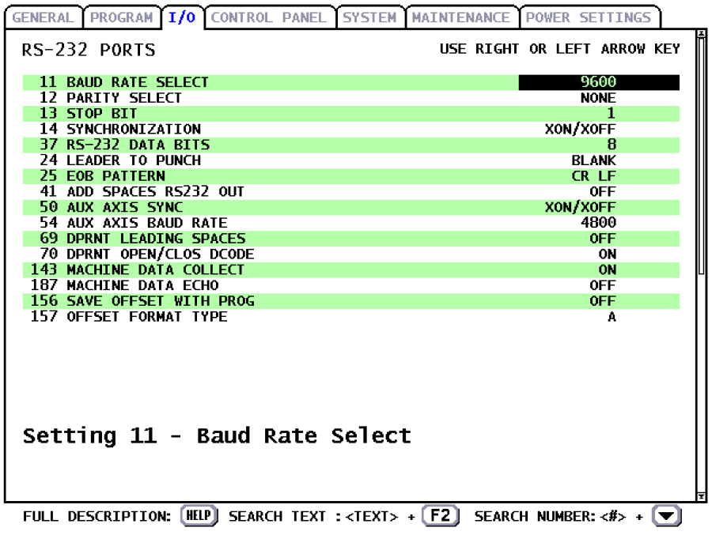
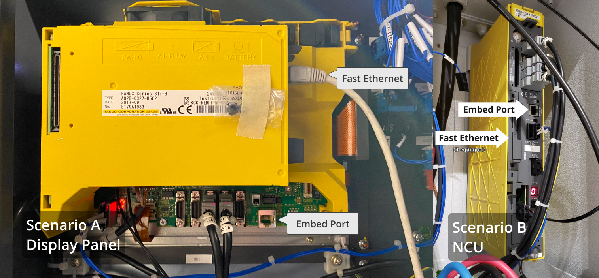
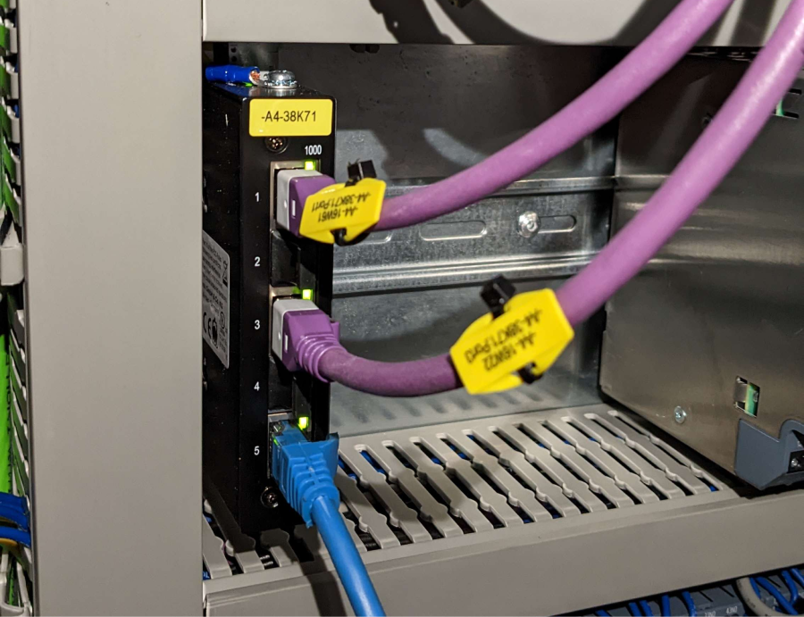
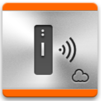
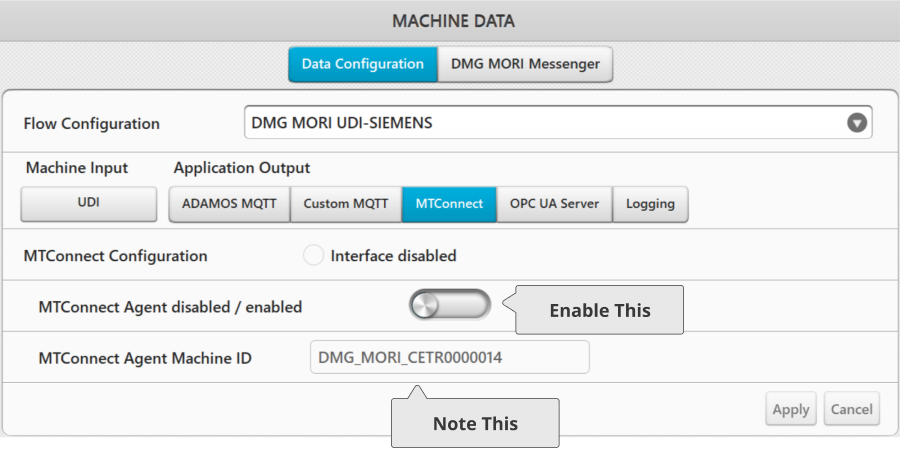

</img>
# Chatter Integration Support Documentation
### Table of Contents

- [About Chatter](#about-chatter)
- [What Machines Does Chatter Support?](#what-machines-does-chatter-support)
- [Setting Up Chatter](#setting-up-chatter)
- [Machine-Specific Documentation](#machine-specific-documentation)
  - [Haas NGC](#haas-ngc)
  - [Haas Coldfire (Pre-NGC)](#haas-coldfire-pre-ngc)
  - [Fanuc](#fanuc)
  - [Brother](#brother)
  - [DMG Mori](#dmg-mori)
  - [Okuma](#okuma)
- [Network Troubleshooting](#network-troubleshooting)
  - [Pinging](#pinging)
  - [I Don’t See My Machines on the Network](#i-dont-see-my-machines-on-the-network)
  - [My Chatterbox Doesn’t Connect](#my-chatterbox-doesnt-connect)
  - [My Chatterbox is Connected, But It is Not Connecting to the Machine](#my-chatterbox-is-connected-but-it-is-not-connecting-to-the-machine)

## About Chatter
Chatter is a cloud-based platform that helps machine shops visualize their data in realtime and transfer files without the headache of complicated integration.

This guide will share some overall things you need to know to get started, as well as machine-specific information.

## What machines does Chatter support?
Our platform is constantly growing and adding more features. Our current configuration allows us to support many different machines and application types including:
- Haas (2008 and up)
- Fanuc (Doosan, Tsugami, Matsuura, etc.)
- Brother
- Mazak w/ MTConnect
- Hurco w/MTConnect
- DMG Mori w/ MTConnect
- Okuma w/ MTConnect
- Heidenhain
- Any other MTConnect-compatible machine (special configuration may be required)

**Visit our [Signup Page](https://chatter.dev/pricing.php#signup) to get started!**

## Setting Up Chattter
1) Download and install the Chatter Desktop Connector from here: https://chatter.dev/pricing.php
2) Open the application and press "Connect to Chatter"
3) Enter your credentials and press "Sign In". This will automatically fill your Connector ID and API key fields in.
4) Any machines previously added to your Chatter account during setup will display here. To add more machines, you have two options:
- Add a machine manually by Name, IP, and Type
- Click "Scan for Machines" to find any other hosts on your network, then add them as a machine
6) Once you see your machines connected, you can now open up the [Chatter Web App](https://app.chatter.dev/) to view your dashboard

For additional machine-specific support with setting up your machine's connectivity, please reference the table of contents.

# Machine-Specific Documentation

## Haas NGC &nbsp;  

### Compatibility
Chatter is compatible with all Haas NGC machines, either over WiFi or Ethernet. **Ethernet is recommended.**

### Machine Setup
1. The machine must be networked with a static IP. Verify the network connection by pinging the device from another computer on the network.
2. Ensure the machine is either wired or in a location with a strong WiFi signal.
3. Configure the machine's IP in the Chatter **"Machine Settings"** page. This should be pre-configured to match what was entered during the signup process.
4. Set **Setting 143** on the machine control to **5051**. This is the TCP port which the Chatterbox uses to communicate with the machine.
5. Ensure the following features are **disabled** on the Haas control:
   - HaasConnect
   - HaasDrop
   - Remote Net Share (Local Net Share can remain on for FTP).

### Chatter Setup
1. Complete all machine setup steps.
2. Restart the machine to ensure network changes have been applied.
3. Power on the Chatterbox or start the desktop connector.
4. Visit [Chatter Diagnostics](https://app.chatter.dev/#/diagnostics) to verify the Chatterbox internet connection and incoming data.
5. Cycle through some data on the machine (change mode, program, tool, etc.) to verify live data is being received into Chatter.

### Macro Configuration
Basic data, like Mode, Program, Spindle Speed, and Tool, are collected into Chatter by default.

- To enable the **part counter** (required for proper analytics and predictions), set **macro #3901** to `"Part Count"` in Chatter.
- For more information on macro configuration, including how to configure additional macros for other data types (e.g., inspection), visit our [Custom Macro Configuration](https://support.chatter.dev/hc/en-us/articles/4444145496347-Custom-Macro-Configuration) page.

### Common Issues
#### Network Not Connecting
- Verify that the machine’s IP matches the one set in Chatter. If you need to change the IP, restart the Chatterbox after updating the setting in Chatter.
- If the network connection is intermittent or shows as "Degraded," verify the following:
  - **Setting 143** is set to **5051**.
  - HaasConnect is disabled.
  - HaasDrop is disabled.
  - Remote Net Share is disabled.

###  Troubleshooting
#### The Box is Not Connecting (No Handshakes in the Log)
- Verify there is sufficient WiFi network coverage. The Chatterbox should be near a WiFi access point, not the machine. For wired connections, contact Chatter support.
- Check that the WiFi network credentials are correct.

#### The Box Connects to Chatter, but There is No Incoming Data
- Verify that both the machine and the Chatterbox can be pinged from another computer on the same network.
- Confirm the machine's IP address is correct in Chatter.
- Ensure **Setting 143** is set to **5051**.
- For further reading, visit [Haas Machine Data Collection - NGC](https://www.haascnc.com/service/troubleshooting-and-how-to/how-to/machine-data-collection---ngc.html).

### Network Conflicts
To ensure a stable connection to your Haas machine, use an Ethernet connection and disable conflicting features. Both Haas Drop and Haas Connect can cause network issues, resulting in poor performance or loss of connection.

#### To Disable Haas Connect:
1. Press `[SETTING]`.
2. Select the **Network** tab.
3. Navigate to the **Haas Connect** sub-tab.
4. Disable Haas Connect.

#### To Disable Haas Drop:
1. Press `[SETTING]`.
2. Select the **Network** tab.
3. Navigate to the **Haas Drop** sub-tab.
4. Press `[F3]` to disable Haas Drop.

By following these steps, you can ensure a stable and reliable connection to your Haas machine.

## Haas Coldfire (Pre-NGC) &nbsp;  
### Integration
#### Compatibility
Chatter is compatible with Haas machines 2008 and up. The connection is via a physical RS-232 connection to a Chatter device, so the onboard networking option is not required.

#### Prerequisites
A Wifi signal must be available at the machine for the Chatterbox to communicate with the network.
Navigate to Settings > I/O tab, and under `RS-232 PORTS`, enter the following values:
| #   | Setting Name            | Value  |
|-----|-------------------------|--------|
| 11  | BAUD RATE SELECT        | 9600   |
| 12  | PARITY SELECT           | NONE   |
| 13  | STOP BIT                | 1      |
| 14  | SYNCHRONIZATION         | XON/XOFF|
| 37  | RS-232 DATA BITS        | 8      |
| 24  | LEADER TO PUNCH         | BLANK  |
| 25  | EOB PATTERN             | CR LF  |
| 41  | ADD SPACES RS232 OUT    | OFF    |
| 143 | MACHINE DATA COLLECT    | ON     |
| 187 | MACHINE DATA ECHO       | OFF    |



### Setup
1) Plug the data cable (USB to RS232) in between the Chatterbox and the machine.
2) Power on the Chatterbox.
3) Visit the [machine's settings page](https://app.chatter.dev/#/settings) to verify Chatterbox internet connection and incoming data.
4) Cycle through some data on the machine (change mode, program, tool, etc) to verify live data is being received into Chatter.

## Troubleshooting
### The box is not connecting
- Verify there is insufficient wifi network coverage.
- Verify the wifi network credentials are incorrect

### The box connects to Chatter, but there is no incoming data.
- Verify the physical RS232 connection is secure
- Verify machine serial settings settings are correct

### Corrupt/Incorrect data is being seen in Chatter
- The machine may not keeping up with the rate of requests from the Chatterbox, change the "Frequency" setting in Chatter to a higher ser number (start with 3) and power cycle the box. This is the number of seconds between requests.
- Make sure there are no duplicate macro variable data types on the machine configuration page (ie there are two entries for a single type of data)

### Machine is in "MEM" mode but program shows "MDI"
This is a known limitation of the Haas controller, it is unable to output a program number while in-cycle.
Wait a small amount of time (~2) seconds after switching from MDI to MEM before pressing the cycle start button.

## Fanuc &nbsp;  

### Compatibility
Chatter requires Fanuc machines to be networked for communication. This includes most relatively recent Fanuc i-Series controls (e.g., 0i, 18i, 31i, 32i). Machines with FOCAS capabilities are compatible.

You can check compatibility by following this video: [Simple Fanuc CNC Networking (FTP & Monitoring)](https://www.youtube.com/watch?v=QnthcR_RZsM).

### Setup
1. Verify that the ethernet cable is connected.
2. Power on the machine.
3. Activate emergency stop.
4. Press the **System** hardkey.
5. Press the `+` softkey on the right-hand side and navigate to one of the following options:
   - **EMBED PORT** if using the embedded port.
   - **ETHERNET** if using a Fanuc Dataserver.
6. Navigate to **COMMON** and configure the following:
   - **IP ADDRESS**: Your desired IP address for the machine.
   - **SUBNET MASK**: `255.255.255.0`
   - **ROUTER IP ADDRESS**: The IP address of your router.
   - **DHCP CLIENT**: `0`
7. Press the **FOCAS2** softkey and configure the following:
   - **PORT NUMBER (TCP)**: `8193`
   - **PORT NUMBER (UDP)**: `0`
   - **TIME INTERVAL**: `0`
8. Completely power cycle the machine.
9. Ping the configured IP from another computer on the network to verify connectivity.

### Locating the ethernet connection:

Many machines include an ethernet port, either near the control panel or in the control cabinet. Some machines will have an ethernet port on the outside which is wired into one of the two locations described below.

**Scenario A:** The port(s) are located on the back of the LCD unit.

**Scenario B:** The port(s) are located on the NCU inside the control cabinet.



If your machine is equipped with the Fast Ethernet / Dataserver option, we recommend this option since it has better file transfer capabilities. Otherwise, use the embedded port.

### Integration
#### Compatibility
Chatter is compatible with Fanuc machines that have FOCAS capabilities. 
The majority of modern Fanuc controls support this by default. To check - follow this video here: [Simple Fanuc CNC Networking (FTP & Monitoring)](https://www.youtube.com/watch?v=QnthcR_RZsM)

For a more detailed breakdown of the options, reference the table below
| Control Series  | Embedded Ethernet | Fast Ethernet | Exec Software      | Option |
|-----------------|-------------------|---------------|--------------------|--------|
| 16/18/21iA, 0iB/C |                 |               |A20B-8100-07706567  | S707   |
| 16/1B/21iB       | Yes              |               |A20B-8100-07706567  | S707   |
| 3xiA/B           | Yes              |               |A20B-8101-00306569  | S707   |
| 0iD              | Yes              |               |A20B-8101-0030658W  | S707   |
| 0iF              | Yes              |               |A20B-8101-0770658Q  | S707   |

## Brother &nbsp;  

### Network Setup
1. Navigate to the **Ethernet/FTP settings** screen on the CNC control.
2. Fill out the settings as follows:

   | Setting                                | Value              |
   |----------------------------------------|--------------------|
   | **Host Name**                          | *Leave blank*      |
   | **Use DHCP**                           | `0`                |
   | **IP Address**                         | `{{Your Desired IP}}` |
   | **Mask Bit**                           | `255.255.255.0`    |
   | **Default Gateway**                    | *Leave blank*      |
   | **Auto Acquisition of DNS Server Addr**| `0`                |
   | **DNS Server Address 1**               | *Leave blank*      |
   | **DNS Server Address 2**               | *Leave blank*      |
   | **Port No.**                           | `10000`            |
   | **Display Slave Command Alarm**        | `0`                |

3. Connect an Ethernet cable from your main network to the machine.
4. Restart the machine if necessary.
5. Verify the machine's connection by pinging it from another device on the network.

## DMG Mori &nbsp;  

DMG Mori CELOS controls connect with Chatter via the network and the MTConnect protocol.

### Connect the Network Cable
1. Connect the network cable as indicated in the machine's manual.
   
   Note that network configurations may vary between machines. Refer to your machine's manual for more information on specific configurations.

   Generally, your machine will have two network interfaces (purple), tied into one switch, as pictured below. This is the switch that you must connect your external ethernet line (blue, in thie photo) to in order to see both devices (ethernet X1 and X2) on the network.

   


### Configure the Ethernet Interface
Connection options will be found under the "Connector Management" app, signified by the below icon:



1. MTConnect communicates over the **Ethernet X1** interface, found in the third box from the left in the settings menu.
2. Navigate to **Network Settings**, then to the **Ethernet X1** tab. Do not modify settings on **Ethernet X2**.
   - **Important**: If FTP is configured on the Siemens control (ETH1/ETH2/X127/X130), the IP configured in CELOS must differ from the Siemens IP to avoid network conflicts.
3. Configure the following:
   - **IP Address**, **Network Mask**, **Gateway**, and **Primary DNS** as desired.
   - Avoid using DHCP unless your DHCP server is configured to assign the machine the same address consistently.

### Enable MTConnect
1. Navigate to the **Machine Data** menu and configure the following settings:
   - **Application Output**: MTConnect
   - **MTConnect Agent**: Enabled
2. Take note of your **MTConnect Agent Machine ID**; you will need this later.



### Test the Connection
1. On your computer, open a web browser and enter the following address:
   ```
   http://YOUR_MACHINE_IP:15404/YOUR_AGENT_MACHINE_ID/probe
   ```
- For example, if the machine's IP is `10.3.11.42` and the agent ID is `DMG_MORI_1836585168A`, you would go to:
  ```
  http://10.3.11.42:15404/DMG_MORI_1836585168A/probe
  ```
- The agent ID is typically `DMG_MORI_` followed by your machine's serial number unless you or an applications engineer has changed it.
2. You should see a web page confirming the MTConnect connection.

### Configure the Agent Machine ID in Chatter
1. Open Chatter at [https://app.chatter.dev/](https://app.chatter.dev/).
2. Navigate to **Settings > Machines > Your Machine**.
3. In the top section, enter the following:
- The machine's **IP address**.
- **Port number** (default is `15404`).
- **MTConnect Machine ID** from earlier.
4. Press **Save** and power cycle your Chatterbox (or restart your Desktop Connector).

**Note**: If the **Port** or **MTConnect Machine ID** options are not visible, contact Chatter support for assistance.

### Final Step
Your configuration is now complete! Navigate to the Chatter diagnostics page for the machine to verify that an incoming data stream is visible.

## Okuma &nbsp;  

### Compatibility
Chatter is compatible with all Okuma machines that support the MTConnect app.

### Prerequisites
1. The machine must be networked with a static IP. Verify the network connection by pinging the device from another computer on the network.
2. The MTConnect app must be installed on your Okuma machine control. Refer to the [official Okuma guide](https://www.myokuma.com/stuff/contentmgr/files/0/403998be6317bc067ab0153e057ad58e/documents/4.1.3.0_installationmanual.pdf) for installation instructions. A full listing of Okuma's MTConnect documentation is available on the [Okuma App Store](https://www.myokuma.com/mtconnect-agent-adapter#app-support)
3. Configure the machine's IP in the Chatter **"Machine Settings"** page. This should match what was entered during the signup process.
4. Set the machine's **MTConnect Machine ID** in Chatter to match the **Device Name** in the Okuma control.

   - Example Device Name: `http://[Your Machine IP]:5000/[Device Name]/probe`
   - Replace `[Your Machine IP]` and `[Device Name]` with your machine's IP address and device name, respectively.


### Setup
1. Complete all prerequisites.
2. Set the machine's **MTConnect Machine ID** to the Device Name and the port to `5000` in Chatter Settings.
3. Power on the Chatterbox or Chatter Desktop Connector.
4. Visit the machine's **Settings** page in Chatter to verify connectivity and incoming data.
5. Cycle through data on the machine (e.g., change mode, program, tool, etc.) to ensure live data is being received in Chatter.


# Network Troubleshooting
### Pinging
A ping is a way for you to verify that the machine is on the network from another computer.
#### On Windows:
1. Open **Start > Command Prompt**.
2. Enter the following command, replacing `Machine_IP_Here` with your machine's IP address:

```bash
ping Machine_IP_HERE
```

3. If the connection is successful, you will see messages saying `"Reply from..."`.

#### On Mac:
1. Open **Terminal**.
2. Enter the following command, replacing `Machine_IP_Here` with your machine's IP address:

```bash
ping Machine_IP_HERE
```

3. If the connection is successful, you will see messages saying `"64 bytes from..."`.
### I don't see my machines on the network
Please verify the following:
- The ethernet port is connected to the machine
- The activity lights on the ethernet port, both on the machine and router/switch side are blinking
- The machine is set to a static IP address
- The machine can be pinged by opening a terminal on another computer and typing `ping YOUR_MACHINE_IP`, eg `ping 10.0.2.52`
### My Chatterbox doesn't connect
Please verify the following:
- The IP of the machine is set correctly and matches the information on the machine's [settings page in Chatter](https://app.chatter.dev/#/settings).
- The machine's connection settings are set properly
- Fanuc: FOCAS2 TCP port set to 8193
- Haas NGC: Setting 143 is set to 5051
- Haas Coldfire: Serial parameters match as shown on the integration page
- Brother: Port is set to 10000
### My Chatterbox is connected, but it is not connecting to the machine
Verify that:
- The IP address on the machine is set to the same address that appears on the machine's [settings page](https://app.chatter.dev/#/settings)
- Both the machine and the Chatterbox are on the same network (and vlan if applicable)

Additional items to verify if using WiFi:
- Verify that the client is on your network with the correct WiFi credentials. If you need to reset the WiFi, please follow the instructions here: [Wifi Configuration Guide](link here)
- The Chatterbox is located in an area with a strong WiFi signal.